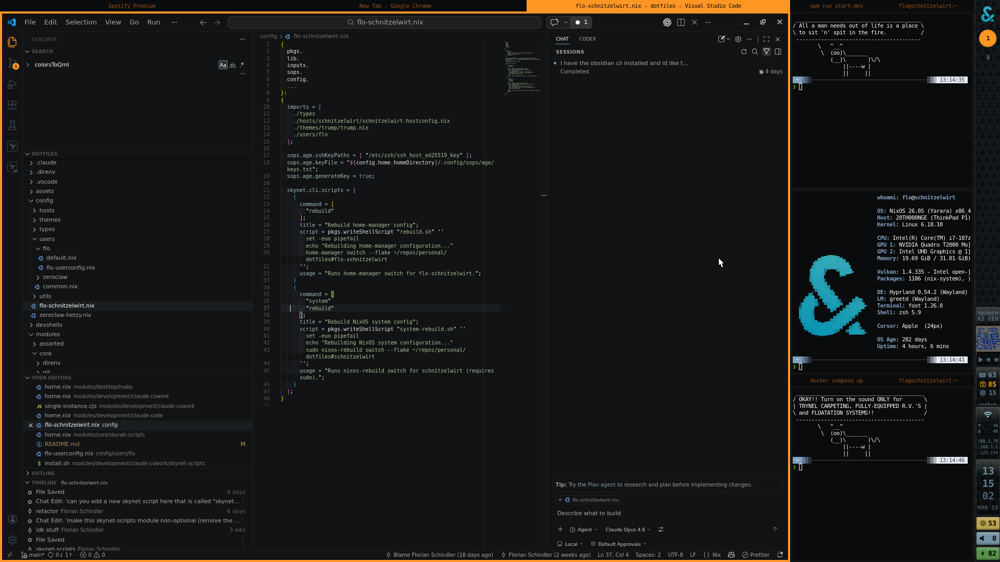

# NixOS Dotfiles

There are many dotfiles but these ones are mine.

## Overview

I use NixOS with Hyprland (hy3) and quickshell. App launcher is vicinae.

## New Machine

Are you on a new machine? Run `bootstrap/bootstrap.sh`.
