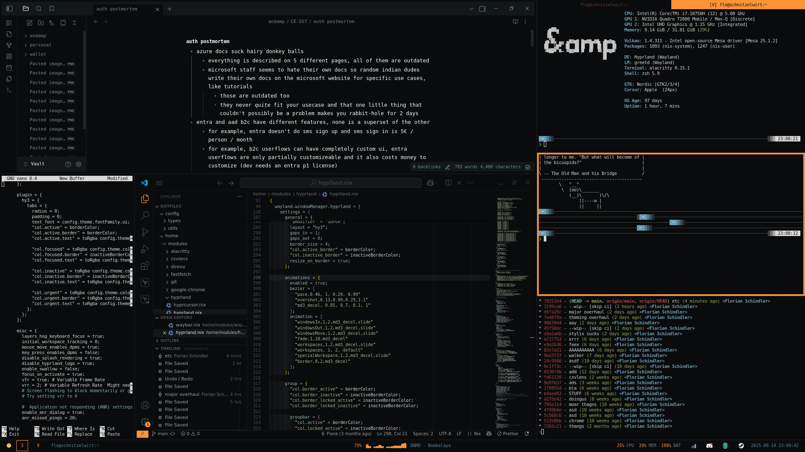

# NixOS Dotfiles

There are many dotfiles but these ones are mine.

## Overview

I use NixOS with Hyprland (hy3) and waybar. App launcher is walker.

The theme is designed for work, so no transparent terminals or huge
gaps; also faster and less animations.

Kinda cool: The entire theme is parametrized on a single primary
color (orange in the screenshots); all other colors are generated
from that.

## TODO

- Make a GTK Theme, or get rid of nautilus
- Theme chrome?

